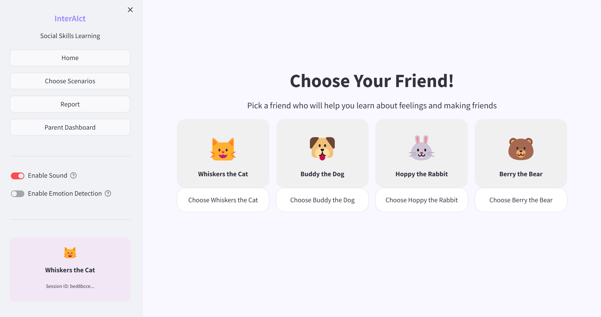
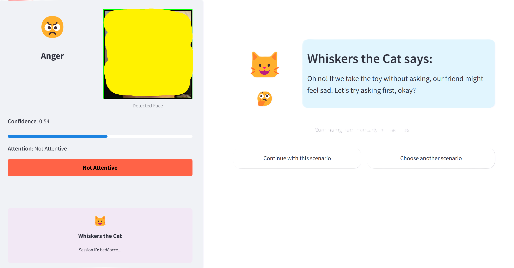
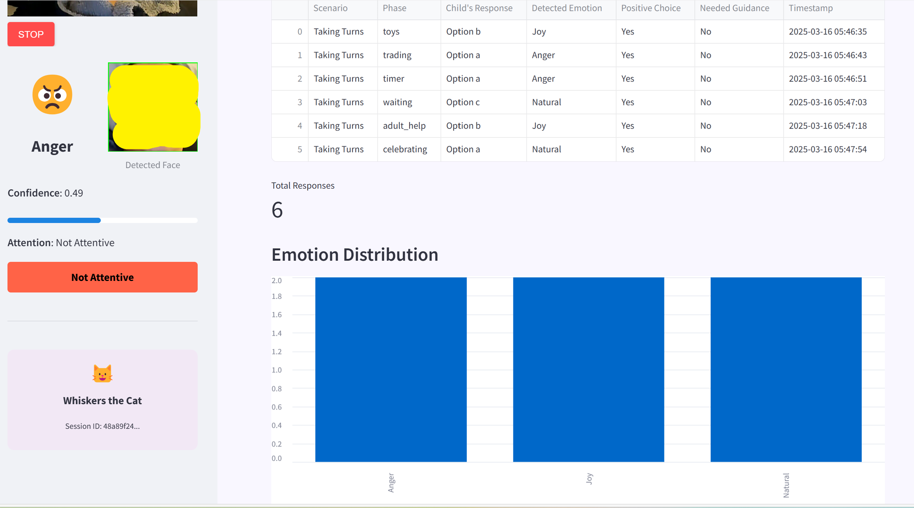

# InterAIct

## -- An intelligent educational tool powered by AI

InterAIct is an AI-powered interactive learning app designed to help autistic children practice social skills in real-world social scenarios, using on-device intelligence for a responsive and immersive experience. This application simulates different social scenarios that children would meet in real life and guidance them on understanding social cues, handling interactions, and responding to real-life situations.

# Table of Contents

1. [Features](#features)
2. [Preview](#preview)
3. [Prerequisite](#prerequisite)
4. [Usage](#usage)
5. [Team](#team)

## Features

- 🐶 **Cute Companion Avatars**
- 😊 **Real-time Emotion Recognition**
- 🛝 **Real-World Scenarios**
- 🎶 **AI Voice Guidance**
- 👏 **Interactive Choices & Feedback**
- 📝 **Emotion Report Genetation**
- 🛟 **High Privacy & Security**

## Preview





## Prerequisite

- Python 3.8+
- Streamlit 1.32.0
- Other dependencies (check [requirements.txt](src/interAIct/requirements.txt))

## Installation

### Clone The Repository:

```bash
git clone [https://github.com/yourusername/InterAIct.git](https://github.com/woodsxwu/InterAIct.git)
cd src/interAIct
```

### Create a Virtual Environment:

#### - Create:

- ***For Windows:***

```bash
python -m venv venv
```

- ***For macOS/Linux:***

```bash
python3 -m venv venv
```

#### - Activate:

- ***For Windows:***

```bash
venv\Scripts\activate
```

- ***For macOS/Linux:***

```bash
source venv/bin/activate
```

### - Install Dependencies:

```bash
pip install -r requirements.txt
```

### - Run:

```bash
streamlit run app.py
```

## Usage

1. Choose an avatar that the child like
2. Choose the scenario for the child to practice with
3. Make choices according to the questions
4. Real-time emotion recognitions and feedback
5. Get feedback after making choices
6. Generate the report for this round of practice

## Team

**Bijing Tang**  
📧 Contact: [tang.bij@northeastern.edu](mailto:tang.bij@northeastern.edu)  
**Charanya Ramprasad**  
📧 Contact: [charanya.ramprasad@gmail.com](mailto:charanya.ramprasad@gmail.com)  
**Renlinhui Li**  
📧 Contact: [li.renl@northeastern.edu](mailto:li.renl@northeastern.edu)  
**Zhixiao Wu**  
📧 Contact: [wu.zhixia@northeastern.edu](mailto:wu.zhixia@northeastern.edu)  
**Zihao Wang**  
📧 Contact: [wang.zihao10@northeastern.edu](mailto:wang.zihao10@northeastern.edu)

## Acknowledgments

We would like to express our gratitude to [Autism Speaks](https://www.autismspeaks.org/social-skills-and-autism) for providing valuable information that contributed to this project.

## License

This project is licensed under the MIT License - see the [LICENSE](LICENSE) file for details.
